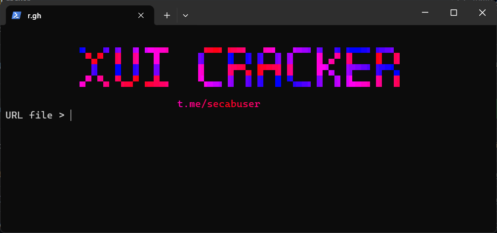

# X-UI Panel Cracker



---

## Overview

X-UI Panel Cracker is a Python-based tool designed to test login credentials for X-UI panels and scan for accessible panels on given IP addresses. The tool is optimized for speed and reliability, with features like asynchronous scanning, proxy support, and detailed logging.

---

## Features

- **Fast Scanning**: Utilizes asynchronous HTTP requests for efficient IP scanning.
- **Comprehensive Logging**: Logs all scan activities and errors to a dedicated log file (`scan_log.txt`).
- **Proxy Support**: Optional proxy usage to enhance privacy during scans.
- **Flexible Output**: Saves valid results in JSON format (`good-sites.json`) for easier analysis.
- **Multi-Protocol Support**: Checks both HTTP and HTTPS protocols for panel accessibility.
- **Progress Tracking**: Displays a progress bar for IP scanning.

---

## 📄 Usage

### Prerequisites

Ensure you have Python 3.8+ installed. Install the required dependencies by running:

```bash
pip install -r requirements.txt
```

### Input Files

1. **`urls.txt`** — List of IP addresses/URLs to scan. Example:
   ```
   http://111.62.217:2053
   https://111.255.198:2053
   121.236.138:2053
   ```

2. **`combos.txt`** — List of username:password combinations for login testing. Example:
   ```
   admin:admin
   user:password123
   ```

3. **`proxies.txt`** (Optional) — List of proxy addresses for scanning. Example:
   ```
   http://proxy1:port
   https://proxy2:port
   ```

### Running the Tool

1. **Scan IPs for Accessible Panels**:
   Run the IP checker script to identify accessible X-UI panels:
   ```bash
   python check-ips.py --ip-file urls.txt --workers 50 --timeout 5.0 --proxy-file proxies.txt
   ```
   - Default values: `--ip-file urls.txt`, `--workers 50`, `--timeout 5.0`.
   - Omit `--proxy-file` if not using proxies.

   **Output**: Results are saved in `good-sites.json` and logs in `scan_log.txt`.

2. **Test Login Credentials**:
   Run the main script to test login credentials on identified panels:
   ```bash
   python main.py
   ```
   Or double-click `start.bat` on Windows.

   **Output**: Valid logins are saved in `valid-logins.txt` and `all-good.txt`.

### Example Command
```bash
python check-ips.py --ip-file urls.txt --workers 100 --timeout 3.0 --proxy-file proxies.txt
```

---

## Notes

- **Ethical Use**: This tool is intended for authorized penetration testing only. Unauthorized use may be illegal.
- **Performance**: Adjust `--workers` based on your system's resources to avoid overload.
- **Dependencies**: Ensure all dependencies listed in `requirements.txt` are installed:
  ```
  aiohttp>=3.8.0
  tqdm>=4.65.0
  requests>=2.31.0
  colorama>=0.4.6
  pystyle>=1.1.0
  ```

---

## 📢 Contact

Join our **Telegram Channel** for updates: [t.me/secabuser](https://t.me/secabuser)